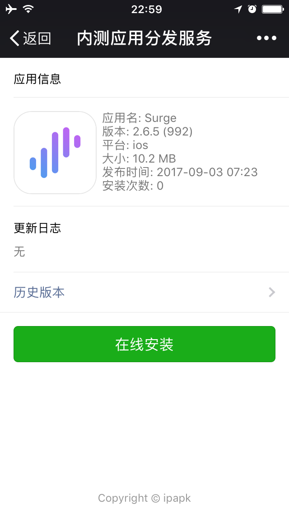

简介
==============
IPA、APK内测应用分发服务，纯 golang 开发

# 支持
- Linux
- Mac OSX

# 编译
```sh
go get github.com/phinexdaz/ipapk-server
# for linux
make linux
# for mac
make darwin
```

# 用法
## 配置文件
```json
{
  "host": "127.0.0.1",
  "port": "8080",
  "proxy": "http://127.0.0.1:8080"  // 自签证书不需要此项配置
}
```

## SSL 证书
该项目会自动生成自签名HTTPS证书，需要手动安装、信任

### iOS 安装、信任证书
1. 点击安装证书
2. 设置 > 通用 > 关于 > 证书信任设置 > 对需要的证书启用完全信任

### 使用商业证书
1. 在项目根目录新建`.ca`目录并拷贝`cer`和`key`文件到此目录
2. `config.json`文件中配置`proxy`值为证书域名
```
.ca
├── mycert1.cer
└── mycert1.key
```
## 开启服务
`$ ./ipapk-server`

## 上传
path:
```
POST /upload
```
param:
```
package:安装包文件, reqiured
changelog:ChangeLog, 仅支持\n换行, optional
```
response:
```json
{
    "uid": "820e8c1b-954a-4489-8d6c-7ea2c47d1ec1",
    "name": "xxxxxxx",
    "platform": "ios",
    "bundleId": "com.xxxxxx",
    "version": "1.0.0",
    "build": "100",
    "install_url": "itms-services://?action=download-manifest&url=https://127.0.0.1:8080/plist/820e8c1b-954a-4489-8d6c-7ea2c47d1ec1",
    "qrcode_url": "https://127.0.0.1:8080/qrcode/820e8c1b-954a-4489-8d6c-7ea2c47d1ec1",
    "icon_url": "https://127.0.0.1:8080/icon/820e8c1b-954a-4489-8d6c-7ea2c47d1ec1",
    "downloads": 0
}
```
示例:
```sh
curl -X POST https://127.0.0.1:8080/upload -F "file=@test.ipa" -F "changelog=123" --insecure
```

# 截图


